## How to Use Matplotlib and Seaborn for Datascience
> <br>
> Matplotlib reference: [https://matplotlib.org/2.1.2/index.html](https://matplotlib.org/2.1.2/index.html)<br>
> Seaborn reference: [https://seaborn.pydata.org/](https://seaborn.pydata.org/)

Matplotlib is a ubiquitious plotting library for python with infinite customization. Seaborn allows you to make graphs very quickly and beautifully though with less modification options. Both are very compatible with pandas and numpy.

Install jupyter:
```
pip3 install jupyter
```
Launch your notebook (opens in browser):
```
jupyter notebook [name_of_file.ipynb]
```
Alternatively, you can run Jupyter Notebooks in Google Drive using [Colaboratory](https://colab.research.google.com/).

## Import
Note: We'll be relying on Pandas and Numpy in this tutorial.

We need to import `matplotlib`! Adding `%matplotlib inline` will make plotting a bit more convenient.

```python
import numpy as np
import pandas as pd
import matplotlib.pyplot as plt
%matplotlib inline
```

## Using Matplotlib built into Pandas

If you have a Pandas dataframe, it actually comes with some basic plotting functions that run the matplotlib code for you. It's a nice shortcut!

`yearly_data` contains the number of registered babies per year.


```python
yearly_data.head()
```


<div>
<style>
    .dataframe thead tr:only-child th {
        text-align: right;
    }

    .dataframe thead th {
        text-align: left;
    }

    .dataframe tbody tr th {
        vertical-align: top;
    }
</style>
<table border="1" class="dataframe">
  <thead>
    <tr style="text-align: right;">
      <th></th>
      <th>Count</th>
    </tr>
    <tr>
      <th>Year</th>
      <th></th>
    </tr>
  </thead>
  <tbody>
    <tr>
      <th>1910</th>
      <td>9164</td>
    </tr>
    <tr>
      <th>1911</th>
      <td>9984</td>
    </tr>
    <tr>
      <th>1912</th>
      <td>17944</td>
    </tr>
    <tr>
      <th>1913</th>
      <td>22094</td>
    </tr>
    <tr>
      <th>1914</th>
      <td>26925</td>
    </tr>
  </tbody>
</table>
</div>


## Line Graphs


```python
yearly_data.plot(kind="line")  #kind='line' is optional
```


    <matplotlib.axes._subplots.AxesSubplot at 0x11a052198>


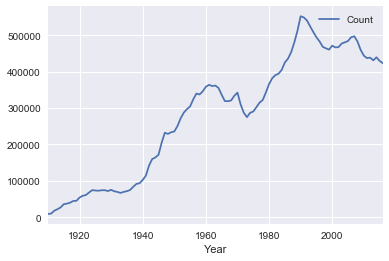


### Study: Name History


```python
# don't worry about this function unless you want to learn about groupby
def your_name_history(name):
    return baby_names[baby_names['Name'] == name].groupby('Year').sum()
```


```python
table = your_name_history('John')

table.plot()
```


    <matplotlib.axes._subplots.AxesSubplot at 0x114a44470>


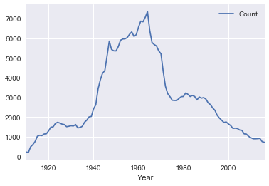


## Bar Graphs

We can modify our data before we graph it to analyze different things.


```python
yearly_data.plot(kind="bar")
plt.axis('off')
```


    (-0.5, 106.5, 0.0, 580000.05000000005)


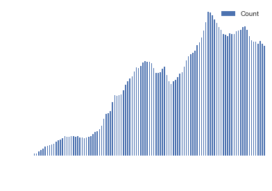


<font color="blue">Class Exercise:</font> How could we graph only the 15 years after World War II (i.e. 1945-1960)?

Hint: create a table with only the desired years first


```python
modified = yearly_data.loc[1945:1960]

modified.plot(kind="bar", figsize=(15,8))
```


    <matplotlib.axes._subplots.AxesSubplot at 0x11b7f5fd0>


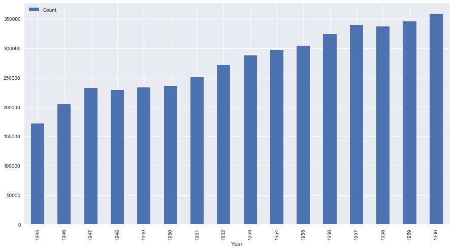


# <font id="2.5" color="blue">Plot with Pandas</font>

## Line Graphs
Use [`plt.plot()`](https://matplotlib.org/api/_as_gen/matplotlib.pyplot.plot.html) to create line graphs! The required arguments are a list of x-values and a list of y-values.


```python
np.random.seed(42) # To ensure that the random number generation is always the same
plt.plot(np.arange(0, 7, 1), np.random.rand(7, 1))
plt.show()
```


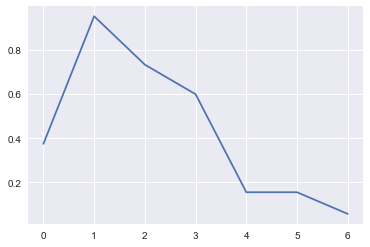


```python
%matplotlib inline

plt.plot(np.arange(0, 7, 1), np.random.rand(7, 1))
# plt.show() no longer required
```


    [<matplotlib.lines.Line2D at 0x11bfb12e8>]


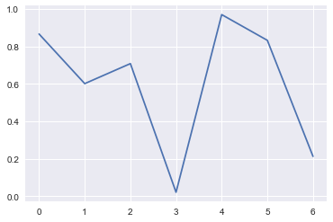

<!--
## Histograms
_@author previous sections: Carlo Cruz-Albrecht_<br>
_@author this section and below: Jun Seo Park_

To explore other types of charts, let's load in a built-in dataset from Seaborn and first take a quick peek:


```python
tips = sns.load_dataset('tips')
tips.head()
```


<div>
<style>
    .dataframe thead tr:only-child th {
        text-align: right;
    }

    .dataframe thead th {
        text-align: left;
    }

    .dataframe tbody tr th {
        vertical-align: top;
    }
</style>
<table border="1" class="dataframe">
  <thead>
    <tr style="text-align: right;">
      <th></th>
      <th>total_bill</th>
      <th>tip</th>
      <th>sex</th>
      <th>smoker</th>
      <th>day</th>
      <th>time</th>
      <th>size</th>
    </tr>
  </thead>
  <tbody>
    <tr>
      <th>0</th>
      <td>16.99</td>
      <td>1.01</td>
      <td>Female</td>
      <td>No</td>
      <td>Sun</td>
      <td>Dinner</td>
      <td>2</td>
    </tr>
    <tr>
      <th>1</th>
      <td>10.34</td>
      <td>1.66</td>
      <td>Male</td>
      <td>No</td>
      <td>Sun</td>
      <td>Dinner</td>
      <td>3</td>
    </tr>
    <tr>
      <th>2</th>
      <td>21.01</td>
      <td>3.50</td>
      <td>Male</td>
      <td>No</td>
      <td>Sun</td>
      <td>Dinner</td>
      <td>3</td>
    </tr>
    <tr>
      <th>3</th>
      <td>23.68</td>
      <td>3.31</td>
      <td>Male</td>
      <td>No</td>
      <td>Sun</td>
      <td>Dinner</td>
      <td>2</td>
    </tr>
    <tr>
      <th>4</th>
      <td>24.59</td>
      <td>3.61</td>
      <td>Female</td>
      <td>No</td>
      <td>Sun</td>
      <td>Dinner</td>
      <td>4</td>
    </tr>
  </tbody>
</table>
</div>


Histograms can be plotted in matplotlib using [`plt.hist()`](https://matplotlib.org/api/_as_gen/matplotlib.pyplot.hist.html).
This will take one required argument of the x-axis variable.


```python
plt.hist(tips['total_bill'])
```


    (array([  7.,  42.,  68.,  51.,  31.,  19.,  12.,   7.,   3.,   4.]),
     array([  3.07 ,   7.844,  12.618,  17.392,  22.166,  26.94 ,  31.714,
             36.488,  41.262,  46.036,  50.81 ]),
     <a list of 10 Patch objects>)


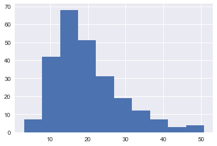


## Scatterplots
Scatterplots can be made using [`plt.scatter()`](https://matplotlib.org/api/_as_gen/matplotlib.pyplot.scatter.html). It takes in two arguments: x-values and y-values.


```python
plt.scatter(tips['total_bill'], tips['tip'])
```


    <matplotlib.collections.PathCollection at 0x11beb8390>


```python
plt.scatter(tips['total_bill'], tips['tip'])
plt.xlabel('Total Bill')
plt.ylabel('Tip Amount')
plt.title('Total Bill vs Tip Amount')
```


    <matplotlib.text.Text at 0x11bed28d0>


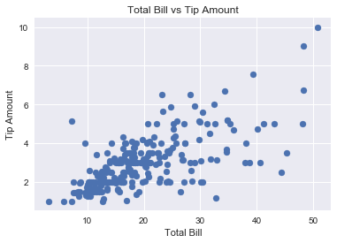


```python
plt.figure(figsize=(15, 10)) # Increase the size of the returned plot

# Points with smoker == 'yes'
plt.scatter(x=tips.loc[tips['smoker'] == 'Yes', 'total_bill'], 
            y=tips.loc[tips['smoker'] == 'Yes', 'tip'],
            label='Smoker', alpha=0.6)

# Points with smoker == 'no'
plt.scatter(x=tips.loc[tips['smoker'] == 'No', 'total_bill'], 
            y=tips.loc[tips['smoker'] == 'No', 'tip'],
            label='Non-Smoker', alpha=0.6)

plt.xlabel('Total Bill')
plt.ylabel('Tip Amount')
plt.title('Total Bill vs Tip Amount (by Smoking Habits)')
plt.legend()
```


    <matplotlib.legend.Legend at 0x11d5f2f28>


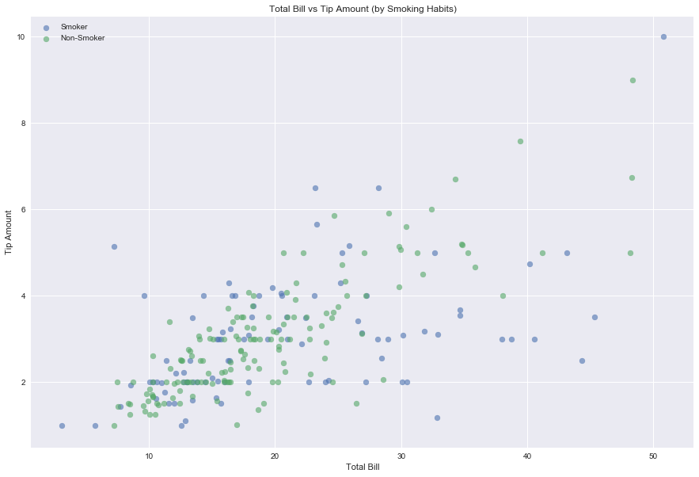


## Exercises in Matplotlib
We'll do the exercises using a famous dataset: [the iris dataset](https://archive.ics.uci.edu/ml/datasets/iris).
First, let's load it in and take a look:


```python
iris = sns.load_dataset('iris')
iris.head()
```


<div>
<style>
    .dataframe thead tr:only-child th {
        text-align: right;
    }

    .dataframe thead th {
        text-align: left;
    }

    .dataframe tbody tr th {
        vertical-align: top;
    }
</style>
<table border="1" class="dataframe">
  <thead>
    <tr style="text-align: right;">
      <th></th>
      <th>sepal_length</th>
      <th>sepal_width</th>
      <th>petal_length</th>
      <th>petal_width</th>
      <th>species</th>
    </tr>
  </thead>
  <tbody>
    <tr>
      <th>0</th>
      <td>5.1</td>
      <td>3.5</td>
      <td>1.4</td>
      <td>0.2</td>
      <td>setosa</td>
    </tr>
    <tr>
      <th>1</th>
      <td>4.9</td>
      <td>3.0</td>
      <td>1.4</td>
      <td>0.2</td>
      <td>setosa</td>
    </tr>
    <tr>
      <th>2</th>
      <td>4.7</td>
      <td>3.2</td>
      <td>1.3</td>
      <td>0.2</td>
      <td>setosa</td>
    </tr>
    <tr>
      <th>3</th>
      <td>4.6</td>
      <td>3.1</td>
      <td>1.5</td>
      <td>0.2</td>
      <td>setosa</td>
    </tr>
    <tr>
      <th>4</th>
      <td>5.0</td>
      <td>3.6</td>
      <td>1.4</td>
      <td>0.2</td>
      <td>setosa</td>
    </tr>
  </tbody>
</table>
</div>


Let's also take a look at the different species:


```python
iris['species'].unique()
```


    array(['setosa', 'versicolor', 'virginica'], dtype=object)


<font color="blue">Exercise:</font> Create a basic scatterplot of the petal lengths versus the petal widths. Label your axes (use the documentation linked above to make them meaningful)!


```python
plt.scatter(iris['petal_length'], iris['petal_width'])
```


    <matplotlib.collections.PathCollection at 0x11d68d0b8>


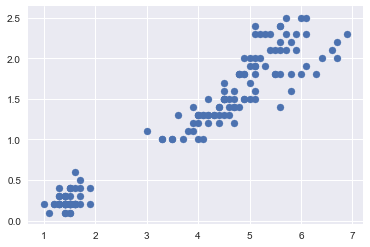


<font color="blue">Exercise:</font> This time, create the same scatterplot, but assign a different color for each flower species.


```python
plt.scatter(x=iris.loc[iris['species'] == 'setosa', 'petal_length'],
            y=iris.loc[iris['species'] == 'setosa', 'petal_width'],
            label='setosa')
plt.scatter(x=iris.loc[iris['species'] == 'versicolor', 'petal_length'],
            y=iris.loc[iris['species'] == 'versicolor', 'petal_width'],
            label='versicolor')
plt.scatter(x=iris.loc[iris['species'] == 'virginica', 'petal_length'],
            y=iris.loc[iris['species'] == 'virginica', 'petal_width'],
            label='virginica')
plt.legend();
```


```python
def plot_by_species(species, x, y):
    plt.scatter(x=iris.loc[iris['species'] == species, x],
             y=iris.loc[iris['species'] == species, y],
             label=species)

for species in iris['species'].unique():
    plot_by_species(species, 'sepal_length', 'sepal_width')

plt.xlabel('Sepal Length (cm)')
plt.ylabel('Sepal Width (cm)')
plt.title('Sepal Length vs Sepal Width (by Species)')
plt.legend()
```


    <matplotlib.legend.Legend at 0x11d624cf8>


# <font id="4" color="blue"> Seaborn</font>

## Histogram
Back to the tips dataset to explore seaborn! First off is seaborn's take on the histogram, [`sns.distplot()`](https://seaborn.pydata.org/generated/seaborn.distplot.html#seaborn.distplot). By default, it shows a relative distribution and overlays a *kernel density estimator*; if you would like seaborn to just show a plain histogram, you can add the argument `kde=False`.


```python
sns.set()

plt.figure(figsize=(15, 10))
plt.subplot(1, 2, 1)
sns.distplot(tips['total_bill'])

plt.subplot(1, 2, 2)
sns.distplot(tips['total_bill'], kde=False)
```


    <matplotlib.axes._subplots.AxesSubplot at 0x1227d54e0>


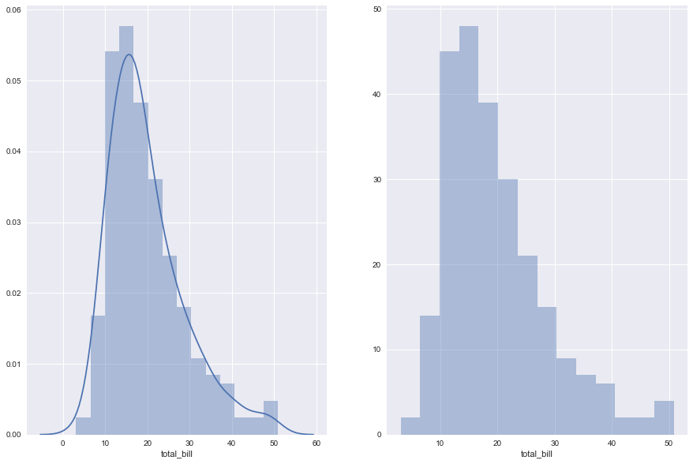


## Scatterplot
To create a scatterplot using seaborn, you can use [`sns.lmplot()`](https://seaborn.pydata.org/generated/seaborn.lmplot.html#seaborn.lmplot). It'll take x-values and y-values, and overlay a least-squares regression line and standard deviation

Note: You can use pandas indexing, but check out the fancy ability to refer to columns by their names instead.


```python
sns.lmplot(x='total_bill', y='tip', data=tips)
```


    <seaborn.axisgrid.FacetGrid at 0x11bf87cc0>


Let's do that same plot from earlier, where we faceted by smoker. It's a lot easier in seaborn, since we only need to pass in an additional argument of `hue`:


```python
sns.lmplot(x='total_bill', y='tip', hue='smoker', data=tips)
```


    <seaborn.axisgrid.FacetGrid at 0x1229b72b0>


Cool. Do smokers' and non-smokers' generosities differ by day of the week? Let's try out the `row` and `col` (column) arguments:


```python
sns.lmplot(x='total_bill', y='tip', row='time', col='smoker', data=tips)
```


    <seaborn.axisgrid.FacetGrid at 0x12296dfd0>


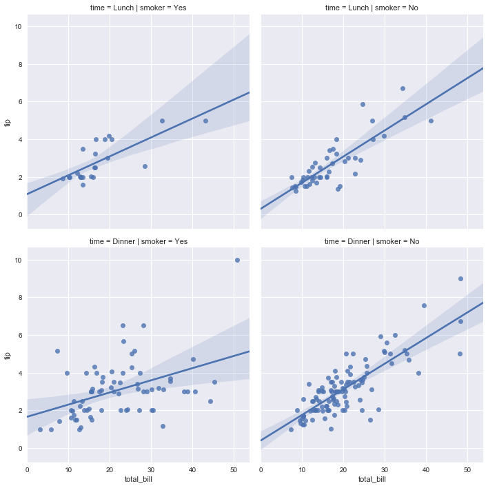


## Seaborn Exercises
<font color="blue">Exercise:</font> Your turn! Create a histogram of the petal widths in the `iris` dataset.


```python
sns.distplot(iris['petal_width'], bins=np.linspace(0, 3, 20))
```


    <matplotlib.axes._subplots.AxesSubplot at 0x122c63b00>


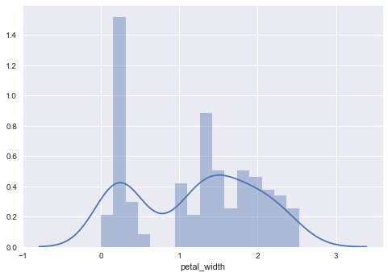


<font color="blue">Exercise:</font> Now try to create a scatterplot of petal lengths versus petal widths, and color the points based on the species of flowers. Feel free to turn off the regression line using `fit_reg=False`.


```python
sns.lmplot(x='petal_length', y='petal_width', hue='species', data=iris, fit_reg=False)
```


    <seaborn.axisgrid.FacetGrid at 0x1231cc4e0>


-->